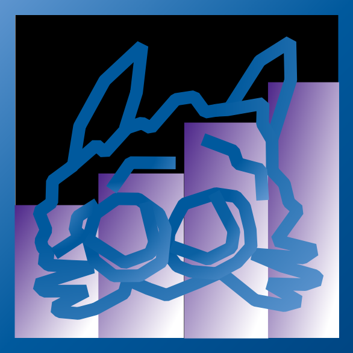

<div align="center">



# sharkvis

Linux only audio visualizer, now in Rust

Inspired by <sub>[cava](https://github.com/karlstav/cava)</sub> and <sub>[cli-visualizer](https://github.com/PosixAlchemist/cli-visualizer) also </sub> </sub>[LyricsMPRIS-Rust](https://github.com/BEST8OY/LyricsMPRIS-Rust)</sub>

</div>

## Features

- PulseAudio / PipeWire support
- Smoothness adjust, noise reduction
- Autosensitivity, manual sensitivity control, adjustable cutoff frequencies
- TUI settings
- Color customization
- Pure Rust
- Uses Musl

## Building

```sh
git clone https://github.com/Matko802/sharkvis.git
cd sharkvis
make deps
make
sudo make install
```
## Updating it

```sh
cd sharkvis && git pull && sudo make install
```
## Usage

```sh
sharkvis
sharkvis -p config.conf
sharkvis -h
```

| Key | Action |
| --- | --- |
| `g` | open settings |
| `q` / `Ctrl-C` | quit |

The config file is looked up in `$SHARKVIS_CONFIG`, then
`~/.config/sharkvis/config`, then `./config`. Settings changed in the panel
are saved automatically when you close the panel or quit.

## Modes

`bars`, `wave`, `oscilloscope`, `text` (switch in the panel with `g`).
`text` renders the current lyric line (or the static `text`) in big
block letters, each letter lit by its own frequency bin exactly like
the bars: bin value drives letter brightness the way it drives bar
height, no auto-gain. `text_size` 1-5 scales the letters (`0` = auto),
`text_style = normal` renders the same line as plain small terminal
text instead (`big ahh` is the default block letters), pulsing with the overall level, with the previous and
next lines above and below forced grey while the current line stays
audio-reactive. The left side follows
the left channel and the right side the right channel.

Beyond the built-in chunky Latin set, any Unicode script renders via
embedded GNU Unifont bitmaps (CJK, Hangul, kana, Cyrillic, Greek,
Arabic presentation forms, …): wide glyphs draw full-height 16px
tall, narrow ones 8px, mixed lines use the tallest. Common accented
Latin letters fold to their base letter (`é` → `E`) so Western text
keeps the uniform look. Small style leans on the terminal itself, so
it covers everything the terminal font does (CJK counts 2 cells).

```ini
[visualizer]
mode = text
text = SHARKVIS
text_source = lyrics
text_size = 1
text_style = big ahh

[lyrics]
folder = ~/Music

[mpris]
players = firefox,spotify
```

Lyrics sources, in order: local `.lrc` files under `folder` (fuzzy
matched on artist + title), [lrclib.net](https://lrclib.net) (exact, then
duration-scored search), [Musixmatch](https://www.musixmatch.com) (anonymous
token, no account needed — true word-level Richsync timing when
available), [Genius](https://genius.com) (no token needed, plain
lyrics spread over the track), then YouTube auto-captions via `yt-dlp`
(from the player URL, else a duration-guarded search).
Results cache per track in `~/.cache/sharkvis/lyrics/`. `players`
whitelists MPRIS players (first playing match wins, `playerctld`
preferred); empty means any. `provider` defaults to `auto`, which
queries lrclib exact, Musixmatch, lrclib search and Genius, then
picks the best per track: word-level timing and full-track synced
coverage win, generated even spreads and stub fragments lose. A
strong lrclib exact hit returns immediately without waiting on the
slower sources. Set an
explicit provider to pin first-hit-wins order instead. `p` cycles
the provider (auto/lrclib/musixmatch/genius).

Text-mode keys (lyrics showing): `s` manual search (`Artist - Title`),
`l` cycle media player, `r` force lyric reload, `c` left/center align,
`a` follow on/off, `p` switch provider, `+`/`-` nudge
sync ±500ms, `0` reset sync.

## Update

Nix flake:

```sh
cd ~/fish-flake
nix flake update sharkvis; nh os switch -H machine1
```

Standalone:

```sh
cd sharkvis && git pull && sudo make install
```

Restart running copies after updating (`q` to quit, relaunch).

## Live state file (jefetch integration)

While running, sharkvis publishes color, levels and gradients ~20x per
second to `$XDG_RUNTIME_DIR/sharkvis/state`
(fallback `/tmp/sharkvis-$UID.state`) so tools like
[jefetch](https://github.com/Matko802/jefetch) follow instantly, without
waiting for the settings panel to close:

```text
color=#ff8800 energy=0.42 beat=1.00 color_low=#ffff00 color_high=#ff0000 bass=0.60 left=0.40 right=0.45
```

- `color` — gradient color at the current volume (`#rrggbb`)
- `energy` — overall volume, mean bar height `0..1`
- `beat` — beat envelope `0..1`: kicks, snares and other onsets lock
  a tempo grid that keeps pulsing through soft hits, recalibrates on
  tempo changes, and drops after unsupported bars
- `bass`, `left`, `right` — bass, left and right channel means `0..1`

Files older than ~1s are stale. Set `SHARKVIS_NO_STATE=1` to disable.
Note: the monitor sees audio only — no song titles or metadata.

## Any distro with Nix:

```sh
nix develop   # drop into a shell with cargo
make          # build inside the dev shell
```
Or
```sh
nix run github:Matko802/sharkvis
```

## As a flake input

```nix
{
  inputs = {
    nixpkgs.url = "github:nixos/nixpkgs/nixos-unstable";
    sharkvis = {
      url = "github:Matko802/sharkvis";
      inputs.nixpkgs.follows = "nixpkgs";
    };
  };

  outputs = { nixpkgs, sharkvis, ... }: {
    packages.x86_64-linux.default = sharkvis.packages.x86_64-linux.default;
  };
}
```

## As an overlay

```nix
{
  inputs = {
    nixpkgs.url = "github:nixos/nixpkgs/nixos-unstable";
    sharkvis = {
      url = "github:Matko802/sharkvis";
      inputs.nixpkgs.follows = "nixpkgs";
    };
  };

  outputs =
    { nixpkgs, sharkvis, ... }:
    let
      system = "x86_64-linux";
    in
    {
      nixosConfigurations.myhost = nixpkgs.lib.nixosSystem {
        inherit system;
        modules = [
          {
            nixpkgs.overlays = [ sharkvis.overlays.default ];
            environment.systemPackages = [ sharkvis.packages.${system}.default ];
          }
        ];
      };
    };
}
```

## Standalone build from source

```sh
nix build github:Matko802/sharkvis
nix run github:Matko802/sharkvis
```

## Develop

```sh
nix develop github:Matko802/sharkvis
```

## License

This project is released under the MIT License. See [LICENSE](https://github.com/Matko802/sharkvis/blob/main/LICENSE).
